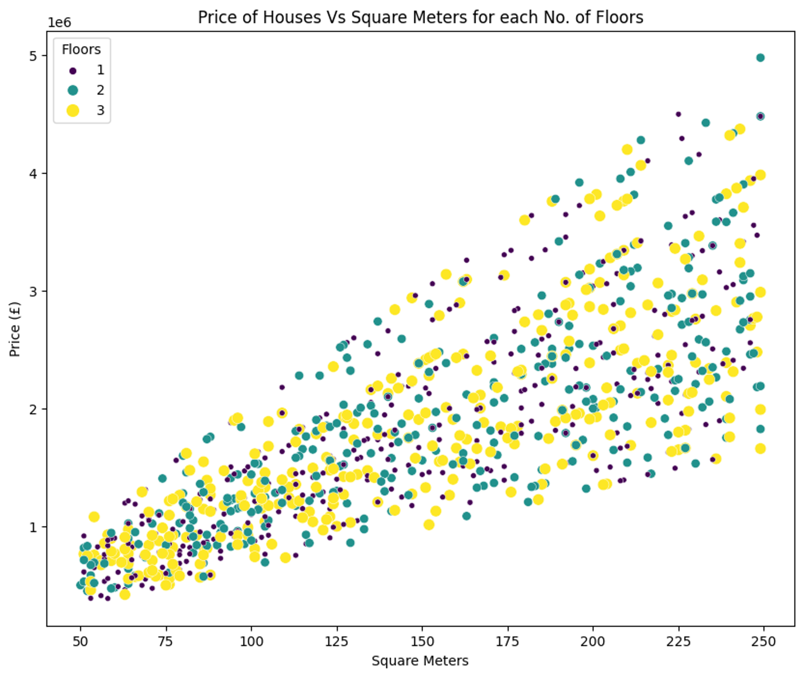

## House Price Prediction using Random Forest 🏠📉

## 📌 Project Overview
This project predicts house prices using various features like number of rooms, location, Property Type	etc.. It uses Random Forest to predict the output values.

## 🧮 Data
Data used for this analysis can be found on Kaggle : https://www.kaggle.com/datasets/oktayrdeki/houses-in-london

## 🔧 Tools & Technologies
- Python
- Pandas, NumPy, Matplotlib, Seaborn
- Scikit-learn, Random Forest Regressor
- Jupyter Notebook

## 📊 Activities
- EDA
- Feature Engineering
- Random Forest Regressor

## 🖼️ Sample Output

